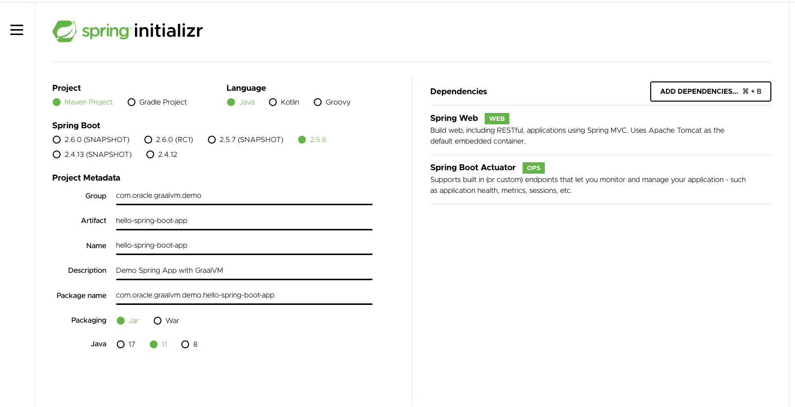
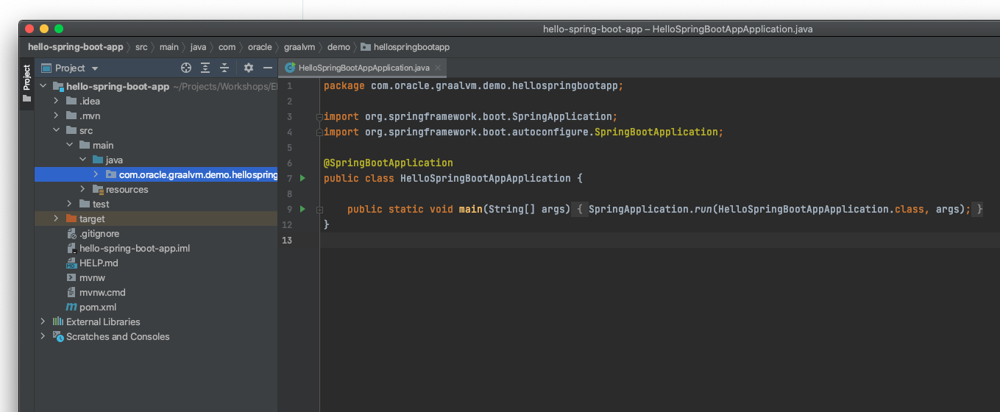

# 01: Creating a simple Spring Boot application

<div class="inline-container">

<span> </span>
<span style="color:blue;font-weight:bold">blue</span>
<strong>
  Estimated time: 15 minutes
</strong>
</div>

<div class="inline-container">

<strong>References:</strong>
</div>

- [Building an Application with Spring Boot](https://spring.io/guides/gs/spring-boot/)

## Overview 
In this lab, the objective is to create a simple Spring Boot application that will be enhanced progressively in the next sections.

## Spring Initializr
Use the [Spring Initializr](https://start.spring.io/) online tool to generate a simple simple Web application with the following dependencies



Fill the form with the following details.
Group: <b>com.oracle.graalvm.demo</b><br>
Artifact: <b>hello-spring-boot-app</b><br>
Description : <b>Demo Spring App with GraalVM</b><br>
Package Name: <b>com.oracle.graalvm.demo.hello-spring-boot-app</b><br>
Packaging: <b>Jar</b><br>
Java:  <b>11</b><br>

Add  <b>Spring Web</b> and <b>Spring Boot Actuator</b> Dependencies.

Click on the  to download the project structure.

Unzip the generated project template and open it in your favorite Editor.


Now the code is ready for modifications.


## Hello Rest Controller 
<div class="inline-container">

<strong>References:</strong>
</div>

In this section just add the following REST Controller 
```java
package com.oracle.graalvm.demo.hellospringbootapp;

import org.springframework.web.bind.annotation.GetMapping;
import org.springframework.web.bind.annotation.RestController;

@RestController
public class HelloController {

	@GetMapping("/")
	public String index() {
		return "Welcome to GraalVM Spring Boot HOL!\n";
	}

}

```
Make sure we are running with GraalVM
```
$ java -version
java version "11.0.13" 2021-10-19 LTS
Java(TM) SE Runtime Environment GraalVM EE 21.3.0 (build 11.0.13+10-LTS-jvmci-21.3-b05)
Java HotSpot(TM) 64-Bit Server VM GraalVM EE 21.3.0 (build 11.0.13+10-LTS-jvmci-21.3-b05, mixed mode, sharing)
```

Add a Unit Test 
```java
package com.oracle.graalvm.demo.hellospringbootapp;

import org.junit.jupiter.api.Test;
import org.springframework.beans.factory.annotation.Autowired;
import org.springframework.boot.test.context.SpringBootTest;
import org.springframework.boot.test.web.client.TestRestTemplate;
import org.springframework.http.ResponseEntity;
import static org.assertj.core.api.Assertions.assertThat;

@SpringBootTest(webEnvironment = SpringBootTest.WebEnvironment.RANDOM_PORT)
public class HelloControllerIT {

	@Autowired
	private TestRestTemplate template;

    @Test
    public void getHello() throws Exception {
        ResponseEntity<String> response = template.getForEntity("/", String.class);
        assertThat(response.getBody()).isEqualTo("Welcome to GraalVM Spring Boot HOL!");
    }
}
```

## Build
In this section we are building the application to produce a JAR File.
this Jar file will be launch using a JRE
USe Gradle 
or Maven to build your application  
```shell
$ ./mvnw package

..
INFO] Tests run: 1, Failures: 0, Errors: 0, Skipped: 0, Time elapsed: 3.088 s - in com.oracle.graalvm.demo.hellospringbootapp.HelloSpringBootAppApplicationTests
[INFO]
[INFO] Results:
[INFO]
[INFO] Tests run: 1, Failures: 0, Errors: 0, Skipped: 0
[INFO]
[INFO]
[INFO] --- maven-jar-plugin:3.2.0:jar (default-jar) @ hello-spring-boot-app ---
[INFO] Building jar: /Users/nono/Projects/Workshops/EMEA-HOL-SpringBoot/hello-spring-boot-app/target/hello-spring-boot-app-0.0.1-SNAPSHOT.jar
[INFO]
[INFO] --- spring-boot-maven-plugin:2.5.6:repackage (repackage) @ hello-spring-boot-app ---
[INFO] Replacing main artifact with repackaged archive
[INFO] ------------------------------------------------------------------------
[INFO] BUILD SUCCESS
[INFO] ------------------------------------------------------------------------
[INFO] Total time:  7.503 s
[INFO] Finished at: 2021-11-04T15:27:32+01:00
[INFO] ------------------------------------------------------------------------
```


## Graal Compiler vs C2
GraalVM comes with a new JIT compiler 

```shell
$ java -jar target/hello-spring-boot-app-0.0.1-SNAPSHOT.jar
```

Send 30000 requests to your application with a concurrency level 100 with Apache Bench or another load tester tool.
```shell
$ ab -n 30000  -c 100 http://localhost:8080/
This is ApacheBench, Version 2.3 <$Revision: 1879490 $>
Copyright 1996 Adam Twiss, Zeus Technology Ltd, http://www.zeustech.net/
Licensed to The Apache Software Foundation, http://www.apache.org/

Concurrency Level:      100
Time taken for tests:   58.214 seconds
Complete requests:      30000
Failed requests:        0
Total transferred:      5070000 bytes
HTML transferred:       1080000 bytes
Requests per second:    515.34 [#/sec] (mean)
Time per request:       194.047 [ms] (mean)
Time per request:       1.940 [ms] (mean, across all concurrent requests)
Transfer rate:          85.05 [Kbytes/sec] received

Connection Times (ms)
              min  mean[+/-sd] median   max
Connect:        0  171 1486.9     22   19323
Processing:     0   22  21.9     19     508
Waiting:        0   21  21.5     18     506
Total:          0  194 1486.1     43   19323

Percentage of the requests served within a certain time (ms)
  50%     43
  66%     51
  75%     58
  80%     62
  90%     69
  95%    107
  98%    164
  99%  11363
 100%  19323 (longest request)
 ```


Restart the application without Graal Compiler 
```shell
java -XX:-UseJVMCICompiler target/hello-spring-boot-app-0.0.1-SNAPSHOT.jar
```

Send the same load to the application instance without Graal Compliler

```shell 
$ ab -n 30000  -c 100 http://localhost:8080/

Concurrency Level:      100
Time taken for tests:   60.561 seconds
Complete requests:      30000
Failed requests:        0
Total transferred:      5070000 bytes
HTML transferred:       1080000 bytes
Requests per second:    495.37 [#/sec] (mean)
Time per request:       201.869 [ms] (mean)
Time per request:       2.019 [ms] (mean, across all concurrent requests)
Transfer rate:          81.76 [Kbytes/sec] received

Connection Times (ms)
              min  mean[+/-sd] median   max
Connect:        0  177 1536.7     22   19308
Processing:     0   24  32.1     21     467
Waiting:        0   24  31.9     20     465
Total:          1  201 1535.6     46   19309

Percentage of the requests served within a certain time (ms)
  50%     46
  66%     54
  75%     61
  80%     63
  90%     70
  95%     83
  98%    311
  99%  11199
 100%  19309 (longest request)

```

By Running this simple helloworld application with GraalVM JIT, we can handle **+20 requests per second in average**

Existing applications can leverage GraalVM JIT to accelerate their performances whitout having to change 
any line of code.

Next, we'll try to explore Native images build for this application.

---
<a href="../2/">
    
</a>


