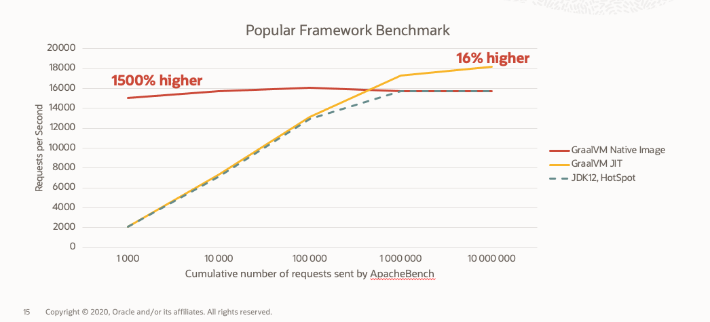

# Profile Guided Optimization

<div class="inline-container">

<span> </span>
<span style="color:blue;font-weight:bold"></span>
<strong>
  Estimated time: 30 minutes
</strong>
</div>

<div class="inline-container">

<strong>References:</strong>
</div>

- [Profile Guided Optimization](https://www.graalvm.org/reference-manual/native-image/PGO/)

## Overview

- Collect application metrics with ApacheBench
- Compare throughputs in both JIT and AOT Mode
- Tune the AOT build


## JIT vs AOT  throughputs

###  JIT Mode 
```
$ java -jar target/hello-spring-boot-app-0.0.1-SNAPSHOT.jar
```


Use ApacheBench to send 100, 1000,10000, 100000 and 1000000 requests to the running application.
Collect the stats especially the Requests per Second

``` 
ab -n 1000000 -s 3600000 localhost:8080/fibonacci/100
```


###  AOT  Mode 


### Sumary 

The different benchmarks completed with ApacheBench in JIT and AOT mode produced the following table.

``` 
ab -n $NB_REQUEST -s 3600000 localhost:8080/fibonacci/100
```

|Req sent by ApacheBench| JIT (Req/sec)      | AOT (Req/sec) |
| :---:|  ---: |  ---: |
|100|     2792.75  |   2664.68    |
|1000|    3206.90   |     2565.73  |
|10000|  1995.87  |     1804.15    |
|100000|  447.11  |     445.17    |
|1000000|   418.83  |  214.35      |

Overall, we can see that the JIT Thoughputs remains better when the number of request increase and outperforms AOT.
This observation is confirmed by various benchmarks on popular Frameworks.



To make AOT matches JIT's cadence, we will rely on Profile Guided optimization to tune the native image.


## PGO in Action 

### Generating a profile with 
We need to supply the --pgo-instrument option to the native image build,

Create a `build-pgo-instrument.sh` file from `build.sh`

Update the native-image command with the ` --pgo-instrument`option 
```
time native-image \
  --verbose \
  --no-server \
  --no-fallback \
  --pgo-instrument \
  -H:TraceClassInitialization=true \
  -H:Name=$ARTIFACT \
  -H:+ReportExceptionStackTraces \
  --allow-incomplete-classpath \
  --report-unsupported-elements-at-runtime \
  -Dspring.graal.remove-unused-autoconfig=true \
  -Dspring.graal.remove-yaml-support=true \
  -cp $CP $MAINCLASS;
  ```

### Instrument the Optimized image
```
$ ./target/native-image/hello-spring-boot-app 
```
Send a couple of request to the application 

```
$ ab -n 100000 -s 3600000 localhost:8080/fibonacci/100
```

Stop the application with ^C

```
$ ls -rtl
total 30024
drwxr-xr-x@  4 nono  staff       128 Nov  3 14:19 src
-rw-r--r--@  1 nono  staff      6608 Nov  3 14:19 mvnw.cmd
-rwxr-xr-x@  1 nono  staff     10070 Nov  3 14:19 mvnw
-rw-r--r--@  1 nono  staff      1354 Nov  3 14:19 HELP.md
-rw-r--r--   1 nono  staff      8423 Nov 13 08:33 hello-spring-boot-app.iml
-rw-r--r--@  1 nono  staff      3422 Nov 13 16:06 pom.xml
-rwxr-xr-x   1 nono  staff      1395 Nov 13 16:34 build.sh
-rwxr-xr-x   1 nono  staff      1417 Nov 17 15:32 build-pgo-instrument.sh
drwxr-xr-x  11 nono  staff       352 Nov 17 15:32 target
-rw-------   1 nono  staff  15322369 Nov 17 15:44 default.iprof
```
A new file is generated `default.iprof`


### Building a native image with PGO Profile 

 We build native image using the --pgo option.

 Create a `build-pgo.sh` file from `build-pgo-instrument.sh`


* Add an instruction to add the default.iprof in the rigth location  `cp default.iprof target/native-image/`
* Update the native-image command with the ` --pgo-instrument`option 
```
time native-image \
  --verbose \
  --no-server \
  --no-fallback \
  --pgo=default.iprof \
  -H:TraceClassInitialization=true \
  -H:Name=$ARTIFACT-pgo \
  -H:+ReportExceptionStackTraces \
  --allow-incomplete-classpath \
  --report-unsupported-elements-at-runtime \
  -Dspring.graal.remove-unused-autoconfig=true \
  -Dspring.graal.remove-yaml-support=true \
  -cp $CP $MAINCLASS;
  ```
Run the script to build the new image 
```
$ ./build-pgo.sh 
```
In the build logs you have a mention to the profile being used 
```
-H:ProfilesUse=/Users/nono/Projects/Workshops/EMEA-HOL-SpringBoot/hello-spring-boot-app/target/native-image/default.iprof \
````


### Perform benchmarks on the profiled AOT image

Run the PGO image 
```
$ ./target/native-image/hello-spring-boot-app-pgo 
2021-11-17 16:03:53.385  INFO 4809 --- [           main] o.s.nativex.NativeListener               : This application is bootstrapped with code generated with Spring AOT

  .   ____          _            __ _ _
 /\\ / ___'_ __ _ _(_)_ __  __ _ \ \ \ \
( ( )\___ | '_ | '_| | '_ \/ _` | \ \ \ \
 \\/  ___)| |_)| | | | | || (_| |  ) ) ) )
  '  |____| .__|_| |_|_| |_\__, | / / / /
 =========|_|==============|___/=/_/_/_/
 :: Spring Boot ::                (v2.5.6)

```

Send 1000000 requests 
```
ab -n 1000000 -s 3600000 localhost:8080/fibonacci/100
```
Througput should now be similar to what you previously had with this appliation running in JIT Mode `(~400 requests per second )`